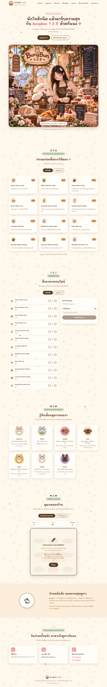

# BungBun うさぎ

เว็บไซต์คาเฟ่กระต่ายคอนเซ็ปต์น่ารักสำหรับแสดงเมนู สั่งอาหาร และเล่นมินิเกมระหว่างรอเครื่องดื่ม

## ภาพตัวอย่างเว็บไซต์



## ฟีเจอร์

- แสดงเมนูเครื่องดื่มและขนมหวานจากข้อมูลชุดเดียวกัน
- ระบบตะกร้าสั่งอาหารและส่งออเดอร์เข้า Firebase Firestore
- หน้าจอจัดการออเดอร์สำหรับพนักงานที่ `staff.html`
- อัปเดตสถานะออเดอร์เป็น **ออเดอร์ใหม่**, **กำลังทำ**, และ **เสร็จแล้ว**
- โปรไฟล์กระต่ายประจำคาเฟ่
- มินิเกม 2 เกม
  - ตีกระต่ายคาบแครอท
  - วิ่งเก็บแครอท
- รองรับการใช้งานบนหน้าจอมือถือ

## เทคโนโลยี

- HTML5
- CSS3
- Vanilla JavaScript (ES Modules)
- Firebase Web SDK 10.12.2
- Firebase Firestore

## โครงสร้างไฟล์

```text
.
├── index.html          # หน้าเว็บหลัก
├── staff.html          # หน้าจอออเดอร์สำหรับพนักงาน
├── style.css           # สไตล์และ responsive layout
├── menu-data.js        # ข้อมูลเมนูที่ใช้ร่วมกันทั้งเว็บ
├── script.js           # พฤติกรรมหน้าเว็บและการแสดงเมนู
├── order.js            # ตะกร้าและการส่งออเดอร์เข้า Firestore
├── staff.js            # Dashboard ออเดอร์สำหรับพนักงาน
├── game.js             # เกมตีกระต่าย
├── game-runner.js      # เกมวิ่งเก็บแครอท
├── firebase-config.js  # ค่าการเชื่อมต่อ Firebase
└── assets/             # รูปภาพ โลโก้ และไฟล์ประกอบเกม
```

## การติดตั้งและเปิดใช้งาน

โปรเจกต์นี้ไม่มี build step หรือ package manager สามารถเปิดด้วย static server ได้ทันที แต่ไม่แนะนำให้เปิดด้วย `file://` เพราะระบบ ES Modules และ Firebase อาจทำงานไม่ครบ

### 1. Clone โปรเจกต์

```bash
git clone https://github.com/sankaew67/bunbung.git
cd bunbung
```

### 2. ตั้งค่า Firebase

1. สร้างโปรเจกต์ที่ [Firebase Console](https://console.firebase.google.com/)
2. เพิ่ม Web App ในโปรเจกต์
3. เปิดใช้งาน **Cloud Firestore**
4. คัดลอกค่าการตั้งค่า Firebase จากเมนู **Project settings > Your apps**
5. นำค่ามาใส่ใน `firebase-config.js`

```js
export const firebaseConfig = {
  apiKey: "YOUR_API_KEY",
  authDomain: "YOUR_PROJECT.firebaseapp.com",
  projectId: "YOUR_PROJECT_ID",
  storageBucket: "YOUR_PROJECT.firebasestorage.app",
  messagingSenderId: "YOUR_MESSAGING_SENDER_ID",
  appId: "YOUR_APP_ID"
};
```

อย่า commit ค่าที่เป็นความลับหรือไฟล์ credential ของ Firebase ลงใน repository

### 3. ตั้งค่า Firestore

ระบบใช้ collection ชื่อ `orders` โดยเอกสารแต่ละรายการมีข้อมูลลักษณะนี้

```json
{
  "items": [
    {
      "name": "Honey Bunny Latte",
      "qty": 1,
      "price": 95,
      "lineTotal": 95
    }
  ],
  "total": 95,
  "note": "โต๊ะ 4",
  "status": "new",
  "createdAt": "server timestamp"
}
```

กำหนด Firestore Security Rules ให้เหมาะกับการใช้งานจริงก่อนนำขึ้น production โดยเฉพาะการอนุญาตให้อ่าน แก้ไข และลบออเดอร์จากหน้าพนักงาน

### 4. รันเว็บแบบ local

ตัวอย่างการใช้ Python:

```bash
python -m http.server 8000
```

จากนั้นเปิด:

- หน้าเว็บไซต์: <http://localhost:8000/>
- หน้าพนักงาน: <http://localhost:8000/staff.html>

หรือใช้ Live Server ใน Visual Studio Code ก็ได้

## การใช้งาน

### ลูกค้า

1. เลือกเมนูจากส่วน **สั่งอาหาร**
2. เพิ่มหรือลดจำนวนสินค้า
3. กรอกชื่อหรือหมายเลขโต๊ะในช่องหมายเหตุ (ถ้ามี)
4. กดยืนยันสั่งอาหาร

### พนักงาน

1. เปิด `staff.html`
2. ใส่ PIN ที่กำหนดไว้ใน `staff.js`
3. กด **เริ่มทำ** เมื่อรับออเดอร์
4. กด **ทำเสร็จแล้ว** เมื่อเตรียมออเดอร์เสร็จ

ค่า PIN เริ่มต้นในโค้ดคือ `2025` และควรเปลี่ยนก่อนใช้งานจริง

> PIN ในโปรเจกต์นี้เป็นเพียงตัวกันการกดเข้าหน้าโดยไม่ได้ตั้งใจ เพราะรหัสถูกเก็บไว้ใน JavaScript ฝั่ง client และผู้ใช้สามารถดู source code ได้ ไม่ควรใช้เป็นระบบยืนยันตัวตนหรือปกป้องข้อมูลสำคัญ

## การแก้ไขเมนู

แก้ไขรายการ ราคา สี ไอคอน และคำอธิบายได้ที่ `menu-data.js` ไฟล์นี้ถูกใช้ร่วมกันโดยหน้าแสดงเมนูและระบบสั่งอาหาร จึงช่วยป้องกันข้อมูลราคาไม่ตรงกัน

## การเผยแพร่บน GitHub Pages

1. Push โปรเจกต์ขึ้น GitHub
2. ไปที่ **Settings > Pages**
3. เลือก **Deploy from a branch**
4. เลือก branch และโฟลเดอร์ `/ (root)`
5. กดบันทึกและรอ GitHub Pages deploy
6. ตรวจสอบว่า Firebase อนุญาตโดเมน GitHub Pages ของโปรเจกต์ใน **Authentication > Settings > Authorized domains** หากจำเป็น

## หมายเหตุ

- เมนูและราคาปัจจุบันเป็นข้อมูลตัวอย่างสำหรับเว็บไซต์คอนเซ็ปต์
- เกมจะเก็บสถิติสูงสุดไว้ใน `localStorage` ของเบราว์เซอร์แต่ละเครื่อง
- หากระบบสั่งอาหารเชื่อมต่อไม่ได้ ให้ตรวจสอบ `firebase-config.js`, Firestore และ Security Rules

## License

โปรเจกต์นี้จัดทำขึ้นสำหรับการศึกษาและสาธิตการทำเว็บไซต์คาเฟ่แบบ static ร่วมกับ Firebase
